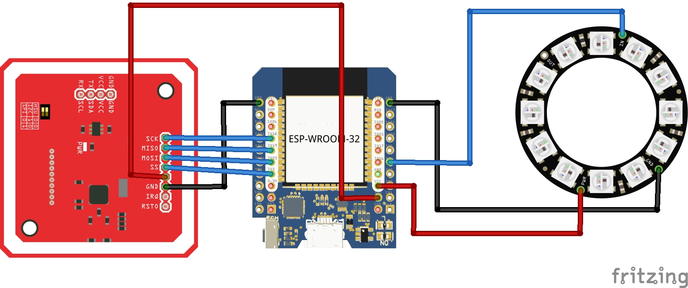

# PN532 Toolkit

A modern Arduino/ESP32 library for the **NXP PN532 NFC controller**, supporting SPI, I²C and High Speed UART.

This project is based on Elmü's excellent PN532 work and has been extended, cleaned up and adapted for modern Arduino and ESP32 development.

## Features

* Arduino Uno, Mega, ESP32 and other Arduino-compatible boards
* SPI, I²C and High Speed UART interfaces
* ISO14443-A card detection
* NTAG21x support
* MIFARE Ultralight and Ultralight-C support
* MIFARE Classic support
* MIFARE DESFire EV1 support
* DES and 3K3DES authentication
* Read and write NDEF records
* Card formatting and personalization
* Extensive examples

## Included Examples

* NTAG215 NDEF Web Writer
* NTAG215 Dumper
* Spotify NTAG215 Writer
* Spotify NTAG215 player
* NTAG215 Avatar builder game
* Mifare DESFire Door Opener with ledring indicator
* Mifare DESFire Card Explorer including full restore
* Mifare Classic card explorer
* Mifare Ultralight-C card explorer
* Card Detection and Identifyer including Magic Examples
* Reader Test Utilities

## Hardware


## Security

The library supports cryptographic DESFire applications.
**Do not store your own cryptographic keys in the repository.**

Instead:
1. Copy `secrets-example.h` to `secrets.h`
2. Replace the example keys with your own random values.
3. `secrets.h` is ignored by Git and will not be uploaded.

The supplied `secrets-example.h` contains placeholder values only.

## Installation

Copy the library into your Arduino `libraries` folder or install it as a ZIP from the Arduino IDE.

```
Arduino
└── libraries
    └── PN532Toolkit
```

## Basic Example

```cpp
#include <PN532.h>

PN532 nfc;

void setup()
{
    nfc.InitHardwareSPI(5, 255);
    nfc.begin();

    if (!nfc.SamConfig())
    {
        while (true);
    }
}

void loop()
{
}
```

## Hardware

### ESP32 Hardware SPI

| PN532 | ESP32               |
| ----- | ------------------- |
| SCK   | GPIO18              |
| MISO  | GPIO19              |
| MOSI  | GPIO23              |
| SS    | GPIO5               |
| RST   | Not connected (255) |

## Project Status

The library is under active development.
Current focus:
* Improved NTAG21x support
* ESP32 examples
* DESFire enhancements
* Documentation
* Additional examples

## Credits

Original PN532 work by **Elmü**.
This repository contains numerous improvements, ESP32 support, additional examples, documentation updates and ongoing maintenance by **Bas Kasteel**.

## License
MIT License.
